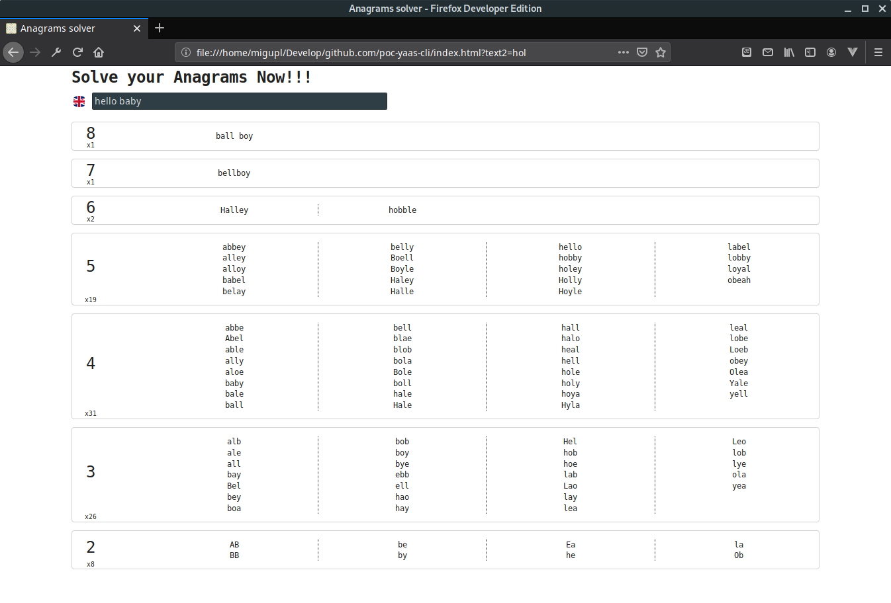
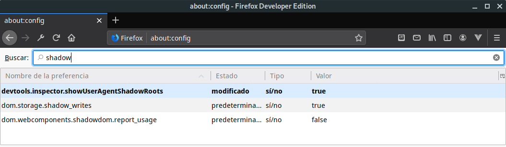

# An anagrams solver simple client using [Web Components][15]

A simple client for [Anagrams Solver Server][2]

Using Wordnet as dictionary at running server you can see for 'hello baby' something like

Thanks to [Belén Albeza][2] for her inspirational '[Web Components API: esto va en serio][3]' talk 
at BilboStack 2019 ([Examples][4]/[Slides][5]))

## Notes from the talk

[Grid Auto-Placement Is Ready][8]

[Web Components][9] = [Custom elements][10] + [Shadow DOM][11] + ([template][12] or [slot][13] tag -[Using both][14]-)

You can activate Shadow DOM inspector at Firefox DevTools as bellow

[Custom Elements Everywhere][16]. Making sure frameworks and custom elements can be BFF

Little frameworks as 
* [Stencil][17]. The magical, reusable web component compiler][]
* [LitElement][18]. A simple base class for creating fast, lightweight web components

## Helpers

[An adventure in CSS with column lists][6]

[Implementing single file Web Components][7]

---
[1]: https://github.com/migupl/poc-yaas-server
[2]: https://twitter.com/ladybenko
[3]: https://bilbostack.com/2019/speaker/belen-albeza/index.html
[4]: https://belen-albeza.github.io/webcomponents-examples/
[5]: https://noti.st/ladybenko/LQunyI
[6]: https://haacked.com/archive/2018/12/03/css-column-list-adventure/
[7]: https://medium.com/content-uneditable/implementing-single-file-web-components-22adeaa0cd17
[8]: https://blogs.igalia.com/mrego/2015/02/25/grid-auto-placement-is-ready/
[9]: https://developer.mozilla.org/en-US/docs/Web/Web_Components
[10]: https://developer.mozilla.org/en-US/docs/Web/Web_Components/Using_custom_elements
[11]: https://developer.mozilla.org/en-US/docs/Web/Web_Components/Using_shadow_DOM
[12]: https://www.w3schools.com/tags/tag_template.asp
[13]: https://developer.mozilla.org/en-US/docs/Web/HTML/Element/slot
[14]: https://developer.mozilla.org/en-US/docs/Web/Web_Components/Using_templates_and_slots
[15]: https://www.webcomponents.org/introduction
[16]: https://custom-elements-everywhere.com/
[17]: https://stenciljs.com/
[18]: https://lit-element.polymer-project.org/